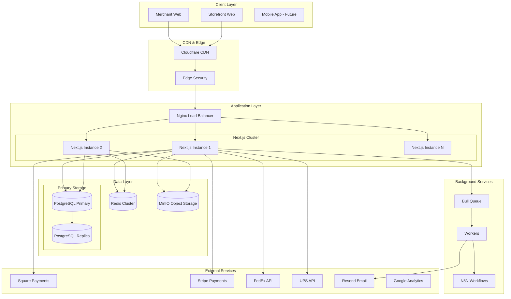

# Shopify Clone Store Architecture Document

## High-Level Architecture

### System Overview
The Shopify Clone platform is designed as a multi-tenant SaaS e-commerce solution built on a modern, scalable architecture. The system leverages a monolithic Next.js application with modular service boundaries, positioned for future microservices migration as scale demands.

### Architecture Diagram



### Architectural Patterns

#### 1. Multi-Tenant Architecture
- **Pattern**: Shared application, isolated data (Hybrid approach)
- **Implementation**: PostgreSQL Row-Level Security with tenant_id discrimination
- **Rationale**: Balance between isolation and resource efficiency

#### 2. Repository Pattern
- **Pattern**: Abstract data access logic behind repository interfaces
- **Implementation**: Prisma ORM with custom repository layer
- **Rationale**: Enables testing and future database migration flexibility

#### 3. Event-Driven Communication
- **Pattern**: Asynchronous event processing for non-critical operations
- **Implementation**: Redis Pub/Sub with Bull Queue
- **Rationale**: Improves response times and system resilience

#### 4. CQRS-Lite
- **Pattern**: Separate read and write models for complex domains
- **Implementation**: Separate query services and command handlers
- **Rationale**: Optimizes for different access patterns

#### 5. API Gateway Pattern
- **Pattern**: Single entry point for all client requests
- **Implementation**: Next.js API routes as gateway
- **Rationale**: Centralized authentication, rate limiting, and routing

## Tech Stack

### Frontend
- **Framework**: Next.js 15.5.2 (App Router)
- **UI Library**: React 18
- **Styling**: Tailwind CSS 3.x
- **Component Library**: Radix UI + Shadcn/ui
- **State Management**: Zustand 4.x
- **Forms**: React Hook Form 7.x + Zod
- **Icons**: Lucide React
- **Charts**: Recharts
- **Internationalization**: next-intl

### Backend
- **Runtime**: Node.js 20 LTS
- **Framework**: Next.js API Routes
- **Language**: TypeScript 5.x (strict mode)
- **ORM**: Prisma 5.x
- **Authentication**: Lucia Auth 3.x
- **Validation**: Zod
- **API Documentation**: OpenAPI 3.0

### Data Storage
- **Primary Database**: PostgreSQL 15
- **Caching**: Redis 7.x
- **Object Storage**: MinIO (S3 compatible)
- **Search**: PostgreSQL Full Text Search (initially)
- **Future**: Elasticsearch for advanced search

### Infrastructure
- **Containerization**: Docker + Docker Compose
- **Process Management**: PM2
- **Reverse Proxy**: Nginx
- **OS**: Ubuntu 22.04 LTS
- **Monitoring**: Custom metrics + Prometheus (future)
- **Logging**: Winston + ELK Stack (future)

### External Services
- **Payments**: Square, Stripe, PayPal
- **Email**: Resend
- **Shipping**: FedEx, UPS, USPS APIs
- **CDN**: Cloudflare
- **Analytics**: Google Analytics 4
- **Automation**: N8N
- **AI Support**: Ollama (local)

### Development Tools
- **Version Control**: Git
- **Code Quality**: ESLint + Prettier
- **Git Hooks**: Husky + lint-staged
- **Testing**: Jest + React Testing Library
- **E2E Testing**: Playwright
- **CI/CD**: GitHub Actions

## Component Architecture

### Frontend Components

```
src/
├── app/                      # Next.js App Router
│   ├── [locale]/            # Internationalization
│   │   ├── (auth)/          # Auth routes
│   │   ├── (merchant)/      # Merchant dashboard
│   │   ├── (storefront)/    # Customer-facing store
│   │   └── api/             # API routes
│   ├── layout.tsx           # Root layout
│   └── global.css           # Global styles
│
├── components/              # Shared components
│   ├── ui/                 # Base UI components (Shadcn)
│   ├── merchant/           # Merchant-specific components
│   ├── storefront/         # Store-specific components
│   ├── shared/             # Shared across contexts
│   └── layouts/            # Layout components
│
├── lib/                    # Utilities and libraries
│   ├── api/               # API client functions
│   ├── auth/              # Auth utilities
│   ├── db/                # Database client
│   ├── email/             # Email templates
│   ├── payments/          # Payment integrations
│   ├── shipping/          # Shipping integrations
│   ├── utils/             # Helper functions
│   └── validations/       # Zod schemas
│
├── stores/                # State management (Zustand)
│   ├── auth.store.ts
│   ├── cart.store.ts
│   ├── merchant.store.ts
│   └── ui.store.ts
│
├── hooks/                 # Custom React hooks
├── types/                 # TypeScript type definitions
├── middleware.ts          # Next.js middleware
└── instrumentation.ts     # Monitoring setup
```

### Backend Services

```
src/
├── services/              # Business logic services
│   ├── tenant/           # Multi-tenancy management
│   ├── product/          # Product management
│   ├── order/            # Order processing
│   ├── payment/          # Payment processing
│   ├── shipping/         # Shipping calculations
│   ├── customer/         # Customer management
│   ├── analytics/        # Analytics and reporting
│   └── notification/     # Email/SMS notifications
│
├── repositories/         # Data access layer
│   ├── base/            # Base repository classes
│   ├── tenant.repo.ts
│   ├── product.repo.ts
│   ├── order.repo.ts
│   └── customer.repo.ts
│
├── workers/             # Background job processors
│   ├── email.worker.ts
│   ├── order.worker.ts
│   ├── sync.worker.ts
│   └── analytics.worker.ts
│
├── middleware/          # Express/Next.js middleware
│   ├── auth.middleware.ts
│   ├── tenant.middleware.ts
│   ├── rateLimit.middleware.ts
│   └── validation.middleware.ts
│
└── config/             # Configuration files
    ├── database.config.ts
    ├── redis.config.ts
    ├── payment.config.ts
    └── app.config.ts
```

## Data Models

### Core Entities

```prisma
// Tenant - Core multi-tenancy model
model Tenant {
  id                String    @id @default(cuid())
  name              String
  slug              String    @unique
  domain            String?   @unique
  subdomain         String    @unique
  status            TenantStatus @default(TRIAL)
  plan              PricingPlan @default(STARTER)
  
  // Settings
  currency          String    @default("USD")
  timezone          String    @default("UTC")
  locale            String    @default("en")
  
  // Relationships
  users             User[]
  stores            Store[]
  products          Product[]
  orders            Order[]
  customers         Customer[]
  
  // Metadata
  createdAt         DateTime  @default(now())
  updatedAt         DateTime  @updatedAt
  
  @@index([status])
  @@index([plan])
}

// Store - Merchant's store configuration
model Store {
  id                String    @id @default(cuid())
  tenantId          String
  name              String
  description       String?
  logo              String?
  favicon           String?
  
  // Theme
  themeId           String
  themeSettings     Json      @default("{}")
  customCss         String?
  
  // SEO
  metaTitle         String?
  metaDescription   String?
  metaKeywords      String[]
  
  // Settings
  maintenanceMode   Boolean   @default(false)
  passwordProtected Boolean   @default(false)
  
  // Relationships
  tenant            Tenant    @relation(fields: [tenantId], references: [id])
  theme             Theme     @relation(fields: [themeId], references: [id])
  
  createdAt         DateTime  @default(now())
  updatedAt         DateTime  @updatedAt
  
  @@unique([tenantId, id])
  @@index([tenantId])
}

// Product - Product catalog
model Product {
  id                String    @id @default(cuid())
  tenantId          String
  storeId           String
  
  // Basic Info
  name              String
  slug              String
  description       String?
  shortDescription  String?
  
  // Pricing
  price             Decimal   @db.Decimal(10, 2)
  compareAtPrice    Decimal?  @db.Decimal(10, 2)
  costPrice         Decimal?  @db.Decimal(10, 2)
  
  // Inventory
  sku               String?
  barcode           String?
  trackInventory    Boolean   @default(true)
  quantity          Int       @default(0)
  
  // Status
  status            ProductStatus @default(DRAFT)
  publishedAt       DateTime?
  
  // SEO
  metaTitle         String?
  metaDescription   String?
  
  // Relationships
  tenant            Tenant    @relation(fields: [tenantId], references: [id])
  variants          ProductVariant[]
  images            ProductImage[]
  categories        Category[]
  
  createdAt         DateTime  @default(now())
  updatedAt         DateTime  @updatedAt
  
  @@unique([tenantId, slug])
  @@index([tenantId, status])
  @@index([tenantId, storeId])
}

// Order - Customer orders
model Order {
  id                String    @id @default(cuid())
  tenantId          String
  orderNumber       String
  
  // Customer
  customerId        String?
  email             String
  phone             String?
  
  // Addresses
  shippingAddress   Json
  billingAddress    Json
  
  // Amounts
  subtotal          Decimal   @db.Decimal(10, 2)
  taxAmount         Decimal   @db.Decimal(10, 2)
  shippingAmount    Decimal   @db.Decimal(10, 2)
  discountAmount    Decimal   @db.Decimal(10, 2)
  total             Decimal   @db.Decimal(10, 2)
  
  // Status
  status            OrderStatus @default(PENDING)
  paymentStatus     PaymentStatus @default(PENDING)
  fulfillmentStatus FulfillmentStatus @default(UNFULFILLED)
  
  // Shipping
  shippingMethod    String?
  trackingNumber    String?
  
  // Relationships
  tenant            Tenant    @relation(fields: [tenantId], references: [id])
  customer          Customer? @relation(fields: [customerId], references: [id])
  items             OrderItem[]
  transactions      Transaction[]
  
  createdAt         DateTime  @default(now())
  updatedAt         DateTime  @updatedAt
  
  @@unique([tenantId, orderNumber])
  @@index([tenantId, status])
  @@index([tenantId, customerId])
}
```

### Database Schema Design

#### Multi-Tenant Data Isolation
```sql
-- Enable Row Level Security
ALTER TABLE products ENABLE ROW LEVEL SECURITY;

-- Create policy for tenant isolation
CREATE POLICY tenant_isolation ON products
  USING (tenant_id = current_setting('app.current_tenant')::uuid);

-- Create indexes for performance
CREATE INDEX idx_products_tenant_id ON products(tenant_id);
CREATE INDEX idx_products_tenant_status ON products(tenant_id, status);
```

#### Data Partitioning Strategy
- Partition large tables by tenant_id for scale
- Consider date-based partitioning for orders and analytics
- Use table inheritance for PostgreSQL partitioning

## API Design

### RESTful API Structure

```
/api/v1/
├── auth/
│   ├── POST   /login
│   ├── POST   /logout
│   ├── POST   /register
│   └── POST   /refresh
│
├── tenants/
│   ├── GET    /current
│   ├── PUT    /current
│   └── POST   /verify-domain
│
├── products/
│   ├── GET    /           # List products
│   ├── POST   /           # Create product
│   ├── GET    /:id        # Get product
│   ├── PUT    /:id        # Update product
│   ├── DELETE /:id        # Delete product
│   └── POST   /import     # Bulk import
│
├── orders/
│   ├── GET    /           # List orders
│   ├── POST   /           # Create order
│   ├── GET    /:id        # Get order
│   ├── PUT    /:id        # Update order
│   ├── POST   /:id/fulfill
│   └── POST   /:id/refund
│
├── customers/
│   ├── GET    /           # List customers
│   ├── POST   /           # Create customer
│   ├── GET    /:id        # Get customer
│   └── PUT    /:id        # Update customer
│
└── webhooks/
    ├── POST   /square     # Square webhooks
    ├── POST   /stripe     # Stripe webhooks
    └── POST   /shipping   # Shipping webhooks
```

### API Authentication & Authorization

```typescript
// JWT Token Structure
interface JWTPayload {
  sub: string;        // User ID
  tid: string;        // Tenant ID
  role: UserRole;     // User role
  permissions: string[];
  iat: number;
  exp: number;
}

// API Middleware Stack
app.use(tenantMiddleware);    // Extract tenant from subdomain/header
app.use(authMiddleware);       // Verify JWT token
app.use(rbacMiddleware);       // Role-based access control
app.use(rateLimitMiddleware);  // Rate limiting per tenant
```

## Security Architecture

### Authentication & Authorization
- **Multi-Factor Authentication**: TOTP-based 2FA
- **OAuth 2.0**: Social login providers
- **Magic Links**: Passwordless authentication
- **Session Management**: Redis-backed sessions
- **RBAC**: Role-based access control per tenant

### Data Security
- **Encryption at Rest**: PostgreSQL TDE
- **Encryption in Transit**: TLS 1.3
- **Key Management**: Environment-based secrets
- **Data Masking**: PII protection in logs
- **Backup Encryption**: Encrypted backups

### Application Security
- **Input Validation**: Zod schemas for all inputs
- **SQL Injection Protection**: Parameterized queries via Prisma
- **XSS Protection**: React's built-in escaping + CSP
- **CSRF Protection**: Token-based protection
- **Rate Limiting**: Per-tenant and per-IP limits

### Compliance
- **PCI DSS**: Token-based payment processing
- **GDPR**: Data privacy and right to deletion
- **CCPA**: California privacy compliance
- **SOC 2**: Security controls (future)

## Performance & Scalability

### Caching Strategy

```typescript
// Cache Layers
interface CacheStrategy {
  // L1: Application Memory Cache
  memory: {
    provider: 'node-cache';
    ttl: 60; // seconds
    maxKeys: 1000;
  };
  
  // L2: Redis Cache
  redis: {
    provider: 'redis';
    ttl: 3600; // seconds
    keyPrefix: 'cache:';
  };
  
  // L3: CDN Cache
  cdn: {
    provider: 'cloudflare';
    ttl: 86400; // seconds
    purgeOnUpdate: true;
  };
}

// Cache Keys Pattern
const cacheKeys = {
  product: (tenantId: string, productId: string) => 
    `tenant:${tenantId}:product:${productId}`,
  
  products: (tenantId: string, filters: string) => 
    `tenant:${tenantId}:products:${filters}`,
  
  cart: (sessionId: string) => 
    `cart:${sessionId}`
};
```

### Database Optimization
- **Connection Pooling**: PgBouncer for connection management
- **Query Optimization**: Explain analyze for slow queries
- **Indexing Strategy**: B-tree and GiST indexes
- **Materialized Views**: For complex analytics
- **Read Replicas**: For read-heavy operations

### Scaling Strategy
1. **Vertical Scaling**: Initial approach for MVP
2. **Horizontal Scaling**: Multiple Next.js instances
3. **Database Sharding**: By tenant_id (future)
4. **Microservices Migration**: Extract services as needed
5. **Edge Computing**: CDN for static assets

## Deployment Architecture

### Container Configuration

```yaml
# docker-compose.yml
version: '3.8'

services:
  app:
    build: .
    ports:
      - "3002:3002"
    environment:
      - NODE_ENV=production
      - DATABASE_URL=${DATABASE_URL}
      - REDIS_URL=${REDIS_URL}
    depends_on:
      - postgres
      - redis
      - minio
    deploy:
      replicas: 3
      resources:
        limits:
          cpus: '2'
          memory: 2G
  
  postgres:
    image: postgres:15-alpine
    volumes:
      - postgres_data:/var/lib/postgresql/data
    environment:
      - POSTGRES_DB=${DB_NAME}
      - POSTGRES_USER=${DB_USER}
      - POSTGRES_PASSWORD=${DB_PASSWORD}
    deploy:
      resources:
        limits:
          cpus: '4'
          memory: 4G
  
  redis:
    image: redis:7-alpine
    command: redis-server --appendonly yes
    volumes:
      - redis_data:/data
    deploy:
      resources:
        limits:
          cpus: '1'
          memory: 1G
  
  minio:
    image: minio/minio
    command: server /data --console-address ":9001"
    volumes:
      - minio_data:/data
    environment:
      - MINIO_ROOT_USER=${MINIO_USER}
      - MINIO_ROOT_PASSWORD=${MINIO_PASSWORD}
```

### CI/CD Pipeline

```yaml
# .github/workflows/deploy.yml
name: Deploy to Production

on:
  push:
    branches: [main]

jobs:
  test:
    runs-on: ubuntu-latest
    steps:
      - uses: actions/checkout@v3
      - uses: actions/setup-node@v3
      - run: npm ci
      - run: npm run test
      - run: npm run build
  
  deploy:
    needs: test
    runs-on: ubuntu-latest
    steps:
      - uses: actions/checkout@v3
      - name: Build Docker Image
        run: docker build -t shopify-clone:${{ github.sha }} .
      - name: Deploy to Server
        run: |
          docker tag shopify-clone:${{ github.sha }} registry/shopify-clone:latest
          docker push registry/shopify-clone:latest
          ssh deploy@server "docker-compose pull && docker-compose up -d"
```

### Monitoring & Observability

```typescript
// Monitoring Setup
interface MonitoringConfig {
  metrics: {
    provider: 'prometheus';
    endpoints: ['/metrics'];
    interval: 10000; // ms
  };
  
  logging: {
    provider: 'winston';
    level: 'info';
    transport: ['console', 'file', 'elasticsearch'];
  };
  
  tracing: {
    provider: 'opentelemetry';
    sampling: 0.1; // 10% sampling
    exporter: 'jaeger';
  };
  
  alerts: {
    provider: 'pagerduty';
    channels: ['email', 'slack'];
    rules: {
      errorRate: { threshold: 0.01, window: '5m' },
      responseTime: { threshold: 2000, window: '1m' },
      availability: { threshold: 0.999, window: '5m' }
    };
  };
}
```

## Source Tree

```
shopify-clone/
├── .github/
│   └── workflows/           # GitHub Actions
├── .docker/
│   ├── Dockerfile          # Production image
│   └── Dockerfile.dev      # Development image
├── docs/
│   ├── prd.md             # Product Requirements
│   ├── architecture.md    # This document
│   └── api/               # API documentation
├── prisma/
│   ├── schema.prisma      # Database schema
│   ├── migrations/        # Database migrations
│   └── seed.ts           # Seed data
├── public/               # Static assets
├── src/
│   ├── app/             # Next.js App Router
│   ├── components/      # React components
│   ├── lib/            # Utilities
│   ├── services/       # Business logic
│   ├── repositories/   # Data access
│   ├── workers/        # Background jobs
│   ├── stores/         # State management
│   ├── hooks/          # React hooks
│   └── types/          # TypeScript types
├── tests/
│   ├── unit/           # Unit tests
│   ├── integration/    # Integration tests
│   └── e2e/           # End-to-end tests
├── scripts/           # Utility scripts
├── docker-compose.yml # Container orchestration
├── package.json       # Dependencies
├── tsconfig.json     # TypeScript config
├── next.config.js    # Next.js config
├── tailwind.config.ts # Tailwind config
├── .env.example      # Environment variables
└── README.md         # Project documentation
```

## Infrastructure and Deployment

### Development Environment

```bash
# Local development setup
npm install
npm run db:migrate
npm run db:seed
npm run dev

# Docker development
docker-compose -f docker-compose.dev.yml up
```

### Staging Environment
- **URL**: staging.platform.com
- **Purpose**: Pre-production testing
- **Database**: Separate PostgreSQL instance
- **Deploy**: Automatic from develop branch

### Production Environment
- **URL**: platform.com
- **Infrastructure**: Ubuntu 22.04 LTS VPS
- **SSL**: Let's Encrypt via Certbot
- **Monitoring**: Uptime monitoring + alerts
- **Backup**: Daily automated backups

### Deployment Strategy
1. **Blue-Green Deployment**: Zero-downtime deployments
2. **Database Migrations**: Run before deployment
3. **Health Checks**: Verify deployment success
4. **Rollback Plan**: Automated rollback on failure
5. **Smoke Tests**: Post-deployment validation

### Disaster Recovery
- **RTO**: 4 hours
- **RPO**: 1 hour
- **Backup Schedule**: Hourly snapshots, daily full backups
- **Backup Retention**: 30 days
- **Recovery Testing**: Monthly DR drills

## Risk Assessment & Mitigation

### Technical Risks
1. **Database Performance at Scale**
   - Risk: Query performance degradation
   - Mitigation: Implement caching, read replicas, and query optimization

2. **Multi-Tenant Data Leakage**
   - Risk: Cross-tenant data exposure
   - Mitigation: RLS policies, automated testing, security audits

3. **Payment Processing Failures**
   - Risk: Transaction failures impact revenue
   - Mitigation: Multiple payment providers, retry logic, monitoring

### Business Risks
1. **Rapid Scaling Requirements**
   - Risk: Infrastructure can't handle growth
   - Mitigation: Auto-scaling, microservices-ready architecture

2. **Compliance Violations**
   - Risk: PCI DSS or GDPR non-compliance
   - Mitigation: Regular audits, compliance automation

### Operational Risks
1. **Dependency on External Services**
   - Risk: Third-party service outages
   - Mitigation: Circuit breakers, fallback mechanisms

2. **Security Breaches**
   - Risk: Data breach or unauthorized access
   - Mitigation: Security-first design, regular penetration testing

## Conclusion

This architecture provides a solid foundation for building a scalable, multi-tenant e-commerce platform. The design prioritizes:

1. **Scalability**: Can grow from hundreds to thousands of stores
2. **Security**: Multi-layered security approach
3. **Performance**: Optimized for fast response times
4. **Maintainability**: Clean architecture with clear boundaries
5. **Flexibility**: Prepared for future microservices migration

The architecture leverages the existing tech stack while introducing patterns and practices that will support long-term growth and evolution of the platform.